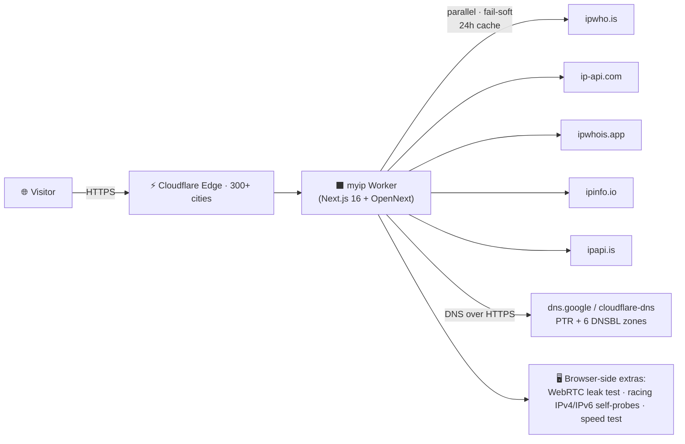

<div align="center">
  
# ⚫ myip — IP Intelligence in Black & White ⚪

**Free, open-source, zero-tracking IP intelligence — running on Cloudflare's global edge.**

*نسخه فارسی این مستندات [این‌جا](README_FA.md) موجود است.*

[](https://github.com/NarimanKhaleghi/myip/blob/main/README_FA.md)
[](https://github.com/NarimanKhaleghi/myip)

---

[](https://github.com/NarimanKhaleghi/myip/stargazers)
[](https://github.com/NarimanKhaleghi/myip/forks)
[](https://github.com/NarimanKhaleghi/myip/watchers)
[](https://github.com/NarimanKhaleghi/myip/commits/main)
[](https://github.com/NarimanKhaleghi/myip/blob/main/LICENSE)
[](https://developers.cloudflare.com/workers/)
[](https://pages.github.com/)
[](https://nextjs.org/)
[](https://www.typescriptlang.org/)
[](https://tailwindcss.com/)
[](https://opennext.js.org/cloudflare)

[](https://myip.thepm.ir)
[](https://narimankhaleghi.github.io/myip/)

</div>

## 📸 Screenshots

| Dark (default) | Light |
|:---:|:---:|
|  |  |

> A **strictly monochrome** interface — the whole site uses only two colors (black `#0a0a0a` and white `#f5f5f5`) plus pattern-based status indicators. No hues. Ever.

## 🌟 About The Project

**myip** answers one question in a thousand ways: *what does the internet know about my IP address?* 

Paste nothing to see your own public IPv4/IPv6 instantly — or search any IP address and get a complete intelligence report: geolocation on a live map, ASN/ISP details, proxy/VPN/hosting detection, DNSBL blacklist status, reverse DNS, IP formats (decimal/hex/binary), WebRTC leak testing and a public JSON API. Everything runs server-side on **Cloudflare Workers** — within milliseconds of your visitors, in 300+ cities.

The project is **fully open source (MIT)**, **bilingual (فارسی + English)** with full RTL/LTR support, keeps **zero logs**, needs **zero configuration** and can be deployed to your own Cloudflare account in about a minute — either by connecting this repo (automatic CI/CD on every push) or with one command. It is a free, self-hostable alternative to ipnumberia.com, ipmyp.ir and whatismyipaddress.com.

## 🎯 Key Features

| Feature | Description |
|:--------|:------------|
| ⚡ **Edge-native** | Runs on Cloudflare Workers (OpenNext + Next.js 16) — served from the datacenter closest to each visitor |
| 🔢 **Full IPv4 + IPv6** | True dual-stack detection: your real public IPv4 is probed via 6 racing IPv4-only endpoints (1.1.1.1, icanhazip, ip.sb, ident.me, wtfismyip, ipify) — correct even when the browser connects over IPv6 — plus your IPv6 address, and lookups for any IPv4/IPv6 address |
| 🧠 **Multi-source aggregation** | Merges **5 free API providers** in parallel (fail-soft), so a single dead API never breaks a lookup |
| 📄 **Single-page report** | All five sections — Overview, Geolocation, Network & ISP, Security, Tools — stacked on one page in order of importance, with a sticky jump-nav (scroll-spy). No tab switching; everything visible & printable |
| 🗺 **Live map & geo data** | Leaflet + OpenStreetMap (grayscale tiles), coordinates, timezone with a live local clock, currency, calling code, capital, borders |
| 🏢 **Network intelligence** | ASN / ASN number / organization, ISP, reverse DNS (PTR), hosting vs residential classification, RIR + WHOIS + BGP links |
| 🛡 **Security report** | Proxy / VPN / hosting / mobile detection, heuristic risk score (0–100), **6 DNSBL blacklists** (SpamCop, SORBS, Spamhaus ZEN, Barracuda, DroneBL …) via DNS-over-HTTPS |
| 🧪 **WebRTC leak test** | Checks whether your browser leaks local IPs through WebRTC ICE candidates |
| ⚖️ **IP compare** | Side-by-side comparison of two addresses with geographic distance (haversine) |
| 🕘 **Lookup history** | Recent searches stored **only in your browser** (localStorage) |
| 📤 **Export** | Download any report as JSON / CSV |
| 📶 **Speed test** | Latency + download speed measurement via Cloudflare |
| 🔳 **QR code** | Shareable QR for every report |
| 🌐 **Bilingual UI** | Full Persian (RTL) + English (LTR) interface, with Persian country names |
| 🌗 **Dark / Light** | Two strictly monochrome themes |
| 📚 **10 SEO articles** | Bilingual educational articles (what is an IP, IPv4 vs IPv6, proxy vs VPN, …) + FAQ |
| 🔌 **Public REST API** | 5 JSON endpoints, no key, no auth, 24h server cache — documented below |
| 📱 **PWA-ready** | Manifest + icons — installable as an app |
| 🎨 **Pure black & white design** | Neo-brutalist monochrome + Swiss typography + blueprint grid, hard shadows, invert-on-hover |

## 🔍 What myip Detects

| Category | Fields |
|:---------|:-------|
| **Identity** | IP address, IPv4/IPv6 version, decimal / hexadecimal / binary formats, IPv4-mapped IPv6, bogon labels (private / loopback / link-local / reserved) |
| **Geography** | Country (+flag), region, city, postal code, latitude/longitude, continent, timezone + live local time, UTC offset, EU membership, borders, capital, currency, calling code |
| **Network** | ASN (e.g. `AS15169`), ASN org, ISP, organization, domain, reverse DNS (PTR) hostname, RIR region, WHOIS / BGP looking-glass links |
| **Security** | Proxy flag, VPN heuristics, Tor/hosting detection, mobile carrier detection, abuse signals, risk score 0–100, 6 DNSBL zones with per-zone status |
| **Your browser** | User-Agent, all received HTTP headers, WebRTC local-IP leak test, screen/locale/timezone hints |

## 🌐 Public REST API

Base URL: `https://myip.thepm.ir/api/v1` — **no API key, CORS enabled, JSON responses**.
Lookups are cached for **24 hours** server-side to protect the free upstream quotas.

| Endpoint | Description |
|:---------|:------------|
| `GET /api/v1/ip` | Aggregated report for the **caller's own IP** |
| `GET /api/v1/ip?raw=1` | Plain-text caller IP only — perfect for `curl` |
| `GET /api/v1/ip?ip=8.8.8.8` | Aggregated report for a given IP |
| `GET /api/v1/ip/{address}` | Same, as a clean path (IPv6-safe) |
| `GET /api/v1/dnsbl/{address}` | PTR record + 6 DNSBL blacklist checks |
| `GET /api/v1/headers` | The HTTP headers your browser actually sent |
| `GET /api/v1/health` | Service status |

```bash
# Your IP, as plain text:
curl https://myip.thepm.ir/api/v1/ip?raw=1

# Full report for 8.8.8.8:
curl https://myip.thepm.ir/api/v1/ip/8.8.8.8

# Blacklist + reverse-DNS check:
curl https://myip.thepm.ir/api/v1/dnsbl/8.8.8.8
```

<details>
<summary><b>📄 Sample response</b> (click to expand — trimmed)</summary>

```json
{
  "ip": "8.8.8.8",
  "version": "IPv4",
  "country": "United States",
  "countryCode": "US",
  "region": "California",
  "city": "San Jose",
  "latitude": 37.3393939,
  "longitude": -121.8949553,
  "timezone": "America/Los_Angeles",
  "utcOffset": "-07:00",
  "asn": "AS15169",
  "asnNumber": 15169,
  "asnOrg": "Google LLC",
  "isp": "Google LLC",
  "hostname": "dns.google",
  "domain": "google.com",
  "isProxy": false,
  "isHosting": true,
  "isMobile": false,
  "riskScore": 30,
  "bogonLabels": [],
  "sourcesUsed": ["ipwho.is", "ip-api.com", "ipwhois.app", "ipinfo.io", "ipapi.is"],
  "sourcesFailed": [],
  "cached": false,
  "fetchedAt": "2026-09-09T17:00:51.260Z"
}
```

Full response in [`docs/sample-response.json`](docs/sample-response.json).

</details>

## 🚀 Deploy Your Own — 4 Ways

The whole app is **zero-config**: no database, no environment variables, no API keys. Fork it, connect it, done.
It builds for **two targets from the same codebase**:

| Target | Runtime | Mode | What you get |
| --- | --- | --- | --- |
| **Cloudflare Workers** ⭐ | Edge (300+ locations) | SSR + REST API | Everything: full report, `/api/v1/*`, 24h server cache |
| **GitHub Pages** | GitHub CDN | Static, client-side | Full UI in the browser: lookups via CORS APIs, DNSBL via DNS-over-HTTPS |

### 1) Connect the GitHub repo (recommended — full CI/CD)

This is the intended deployment path: **push to `main` → Cloudflare rebuilds & redeploys automatically.**

1. Push this project to a GitHub repository:

   <details>
   <summary><b>🐙 How to push from your own machine</b></summary>

   ```bash
   cd myip

   # Create an EMPTY repo on github.com:
   #   + (top right) → New repository → name: myip → Public
   #   ⚠️ do NOT tick "Add a README / .gitignore / license" (this project already has them)

   git init
   git branch -M main
   git add .
   git commit -m "feat: myip v1.1.0 — bilingual IP intelligence on Cloudflare Workers + GitHub Pages"
   git remote add origin https://github.com/NarimanKhaleghi/myip.git   # ← your username
   git push -u origin main
   ```

   On first push, GitHub asks you to authenticate: on Windows, Git Credential Manager
   opens the browser ("Sign in with browser"); on Linux/macOS create a
   [Personal Access Token](https://github.com/settings/tokens) and use it as the password.
   Alternative with [GitHub CLI](https://cli.github.com): `gh auth login && gh repo create myip --public --source=. --remote=origin --push`
   </details>

2. Go to **[dash.cloudflare.com](https://dash.cloudflare.com)** → **Workers & Pages** → **Create** → **Worker** → **Connect Git** (import a repository).
3. Authorize the **Cloudflare GitHub app** and select your `myip` repo (only this repo).
4. Cloudflare auto-detects Next.js and pre-fills the build settings. Make sure they say:
   - **Build command:** `npx opennextjs-cloudflare build`
   - **Deploy command:** `npx opennextjs-cloudflare deploy`
   - **Root directory:** `/`
5. Click **Save and Deploy** — the first build takes ~2–3 minutes.
6. You get `https://myip.<your-subdomain>.workers.dev` immediately.
7. *(Optional)* Custom domain: Worker → **Settings** → **Domains & Routes** → **Add Custom Domain** → `myip.yourdomain.com`. DNS + SSL are configured automatically (the zone must live in the same Cloudflare account).

### 2) One-click deploy button

[](https://deploy.workers.cloudflare.com/?url=https://github.com/NarimanKhaleghi/myip)

Clicking this clones the repo into *your* Cloudflare account and sets up the same CI/CD pipeline.

### 3) Wrangler CLI (from your machine)

```bash
git clone https://github.com/NarimanKhaleghi/myip.git
cd myip
bun install            # or: npm install
npx wrangler login     # opens a browser to authorize
bun run deploy:worker  # build + deploy in one step
```

### 4) GitHub Pages (static, client-side)

A ready-made workflow builds the static export on every push to `main`:

1. Push the repo to GitHub (see step 1 above).
2. Repo **Settings → Pages → Build and deployment → Source: GitHub Actions**.
3. Done — every push to `main` (or a manual run from the **Actions** tab) publishes to
   `https://<username>.github.io/myip/` automatically.

The static build ships the full UI and runs entirely in the visitor's browser: IP data is
aggregated directly from CORS-enabled public APIs, and DNSBL/PTR checks run over
DNS-over-HTTPS (`dns.google` / `cloudflare-dns`). Server-only extras (the REST API, echoed
HTTP headers) fall back gracefully — the UI links them to the canonical Workers deployment.
To build the static export manually:

```bash
bun run build:static    # → ./out  (BUILD_TARGET=static, base path /myip)
```

> **Optional power-ups** for Workers (both commented inside `wrangler.jsonc`):
> - a **custom domain** (`routes` block) — attach `myip.yourdomain.com`,
> - a **KV namespace** (`kv_namespaces` block) — cross-isolate cache for even higher hit-rates.
> The app works perfectly without either of them.

## 🧰 Local Development

```bash
git clone https://github.com/NarimanKhaleghi/myip.git
cd myip
bun install            # or: npm install

bun run dev             # Next.js dev server      → http://localhost:3000
bun run lint            # ESLint (src)
bun run typecheck       # tsc --noEmit
bun run build:worker    # full OpenNext Workers build (no Cloudflare account needed)
bun run preview:worker  # run the real Worker locally on workerd → http://localhost:8787
bun run build:static    # static GitHub Pages export → ./out
```

`preview:worker` runs the **exact same runtime as production** (Cloudflare workerd) — if it works there, it works deployed.

## 🏗 Architecture & Data Sources



| Layer | Technology |
|:------|:-----------|
| **Runtime** | Cloudflare Workers + OpenNext adapter (`nodejs_compat`) — or fully static on GitHub Pages |
| **Framework** | Next.js 16 (App Router) · React 19 · TypeScript |
| **UI** | Tailwind CSS 4 · shadcn/ui (Radix) · Leaflet + OpenStreetMap · qrcode · lucide-react |
| **Data** | 5 free geo-IP APIs (merged field-by-field) · DoH (dns.google, cloudflare-dns) · 6+6 racing self-IP probes (v4-only/v6-only endpoints) · speed.cloudflare.com |
| **Caching** | 24h in-memory lookup cache (per isolate) — KV optional |
| **Typefaces** | Vazirmatn (fa) · Inter (en) · JetBrains Mono (IPs) · Lalezar (display) |

Every upstream call has a timeout and **fails soft**: if a provider dies, the report is still served from the remaining sources, and `sourcesFailed` tells you what happened. No single point of failure.

**Dual-target build.** The same codebase produces both artifacts — `bun run build:worker` (SSR Worker) and `bun run build:static` (static export). In the static build, `src/lib/client-lookup.ts` mirrors the server aggregation in the browser: it queries the CORS-enabled providers directly, resolves PTR + DNSBL over DoH, and derives hosting/proxy heuristics from ASN/org keywords. The deployment target is selected at build time via `BUILD_TARGET=static` + `NEXT_PUBLIC_STATIC_BUILD=1` (see `.github/workflows/deploy-pages.yml`).

## 🎨 Design System — Pure Black & White

myip is deliberately **strictly monochrome**: only `#0a0a0a` and `#f5f5f5` (plus alpha blends of them) appear anywhere — buttons, charts, the map, even the country flags are rendered grayscale.

| Token | Value | Usage |
|:------|:------|:------|
| Sharp corners | `border-radius: 0` | everything except chip pills |
| Hard shadows | `4px 4px 0` offset | hover/press states — no blur |
| Status = pattern | filled / hatched / dashed | ok / alert / unknown — never color |
| Blueprint grid | 72px background grid + 4% grain | the "engineering paper" feel |
| Invert-on-hover | fg↔bg swap + `translate(-2px,-2px)` | buttons, section links, chips |
| Custom cursor | dot + ring, `mix-blend-mode: difference` | desktop only, motion-safe |

The full token set lives in [`src/app/globals.css`](src/app/globals.css).

## 🔒 Privacy

- **No accounts, no cookies, no analytics, no logs.** The Worker stores nothing on disk.
- Lookup history is kept **only in your browser's localStorage** — clear it and it's gone.
- The only data myip ever touches is the IP you looked up, and it is forwarded to public geo-IP APIs to build the report — never stored, never resold.
- Deploy it yourself and you don't even have to trust us. 😉

## 📣 Submitting myip to Google (SEO Guide)

The site ships with everything Google needs **already built in**: `sitemap.xml`, `robots.txt`, canonical URLs, Open Graph + Twitter cards, JSON-LD structured data (`WebApplication`, `WebSite` + `SearchAction`), 10 bilingual articles and an FAQ block. What's left is telling Google you exist:

1. **Open [Google Search Console](https://search.google.com/search-console)** and sign in with your Google account.
2. **Add property → Domain → `thepm.ir`** (a Domain property covers all subdomains, including `myip.`).
3. Google shows you a **TXT record**. Add it in **Cloudflare Dashboard → your domain → DNS → Add record** (type `TXT`, name `@`, paste the value). Wait 1–5 minutes, then click **Verify** in Search Console.
4. In the left menu go to **Sitemaps**, enter `https://myip.thepm.ir/sitemap.xml` and hit **Submit**.
5. Open **URL Inspection** (top search bar), paste `https://myip.thepm.ir/`, and click **Request indexing**.
6. Repeat step 5 for `https://myip.thepm.ir/?lang=en` and your favorite article anchors.
7. Expect first impressions in Google within **1–7 days**; rankings grow over the following weeks.

**Tips for faster indexing:** link the site from your GitHub profile, other repos and social profiles (backlinks = crawl discovery); share `https://myip.thepm.ir/ip/8.8.8.8`-style URLs in answers/forums; submit the same sitemap to **[Bing Webmaster Tools](https://www.bing.com/webmasters)** (it can import everything from Google with one click); keep pushing content — every deploy refreshes `lastmod` in the sitemap.

## 🗺 Roadmap

- [ ] KV / Durable-Object cache binding for cross-isolate hit-rates
- [ ] TOR exit-node & relay list cross-check
- [ ] Abuse/contact lookup (WHOIS abuse mail) for reported IPs
- [ ] More languages (Arabic, Turkish, …)
- [ ] Article RSS/Atom feed
- [ ] Optional self-hosted tile server for fully autonomous maps

## 🤝 Contributing

Contributions are very welcome!

```bash
git clone https://github.com/NarimanKhaleghi/myip.git
cd myip && npm install
npm run dev        # develop on http://localhost:3000
```

- Branch from `main`, keep PRs focused.
- `npm run lint` and `npm run typecheck` must pass (CI enforces both + a full Workers build).
- **Design rule:** the UI stays strictly black & white — status must be expressed with patterns (fill/hatch/dash), never color.
- New IP data source? Add an adapter in `src/lib/ip-sources.ts` and register it in `ALL_SOURCES`.

See [`CONTRIBUTING.md`](CONTRIBUTING.md) for the full guide.

## ❓ FAQ

<details>
<summary><b>Is myip really free?</b></summary>

Yes — the code is MIT-licensed and every upstream data source has a free tier. Cloudflare's Workers free plan (100k requests/day) is enough for a personal or small-community deployment.
</details>

<details>
<summary><b>Why is my city wrong?</b></summary>

Geo-IP is a *database estimate* of where your ISP's routing point is — not GPS. Accuracy is typically city/region level and worse on mobile networks or VPNs. myip shows data from 5 sources so you can compare.
</details>

<details>
<summary><b>Do you store my IP address?</b></summary>

No. There is no database and no request logging. The only persistence is your own browser's localStorage (theme, language, lookup history).
</details>

<details>
<summary><b>How do I hide my IP?</b></summary>

Use a reputable VPN, the Tor Browser, or a proxy — in that order of convenience. Then re-check the Security section on myip to see what still leaks (WebRTC is a common one).
</details>

<details>
<summary><b>Can I use the API commercially?</b></summary>

The myip API itself: yes, fair use. But respect the upstream providers' terms — if you need heavy volume, deploy your own instance and add your own paid API keys.
</details>

## 📞 Contact

| Channel | Link |
|:--------|:-----|
| 🌐 Website | [myip.thepm.ir](https://myip.thepm.ir) |
| 🐙 GitHub | [github.com/NarimanKhaleghi/myip](https://github.com/NarimanKhaleghi/myip) |
| ✉️ Email | [pm@thepm.ir](mailto:pm@thepm.ir) |
| 🐛 Issues & feature requests | [Issues](https://github.com/NarimanKhaleghi/myip/issues) |

## 📄 License

Distributed under the **MIT License** — see [`LICENSE`](LICENSE).
Free to use, modify, and self-host. A ⭐ star is always appreciated!

---

<div align="center">


**ساخته شده با ❤️ توسط نریمان**

**Made with ❤️ by Nariman**

MIT © 2026 Nariman Khaleghi · [github.com/NarimanKhaleghi/myip](https://github.com/NarimanKhaleghi/myip)

</div>

