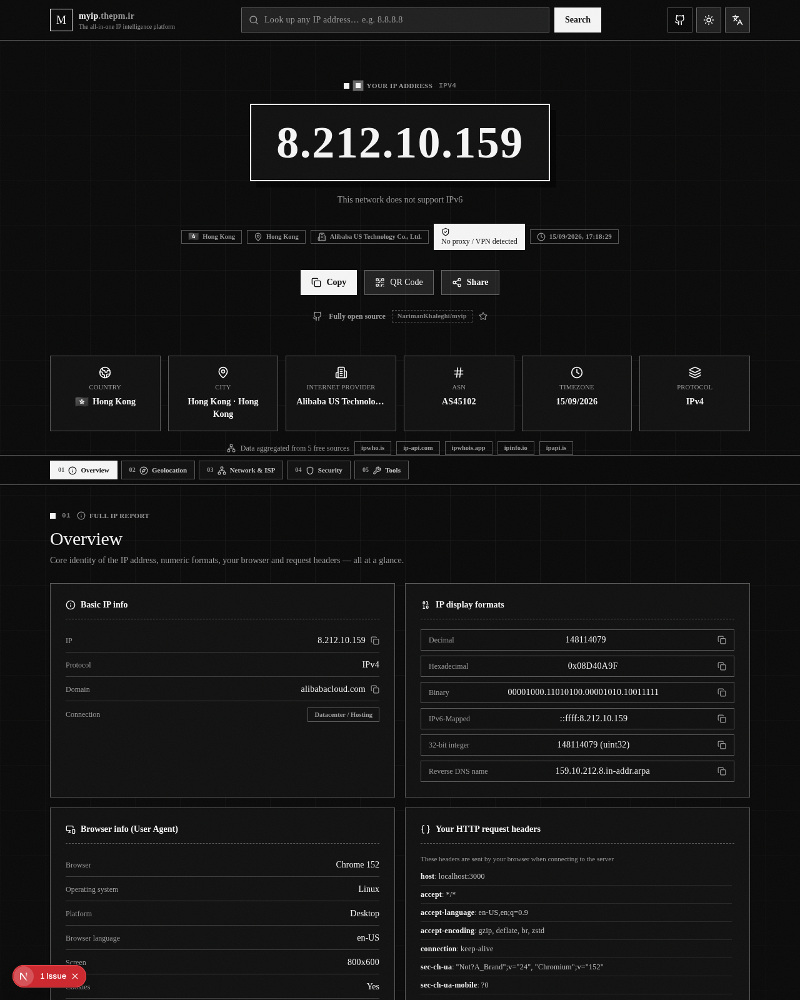
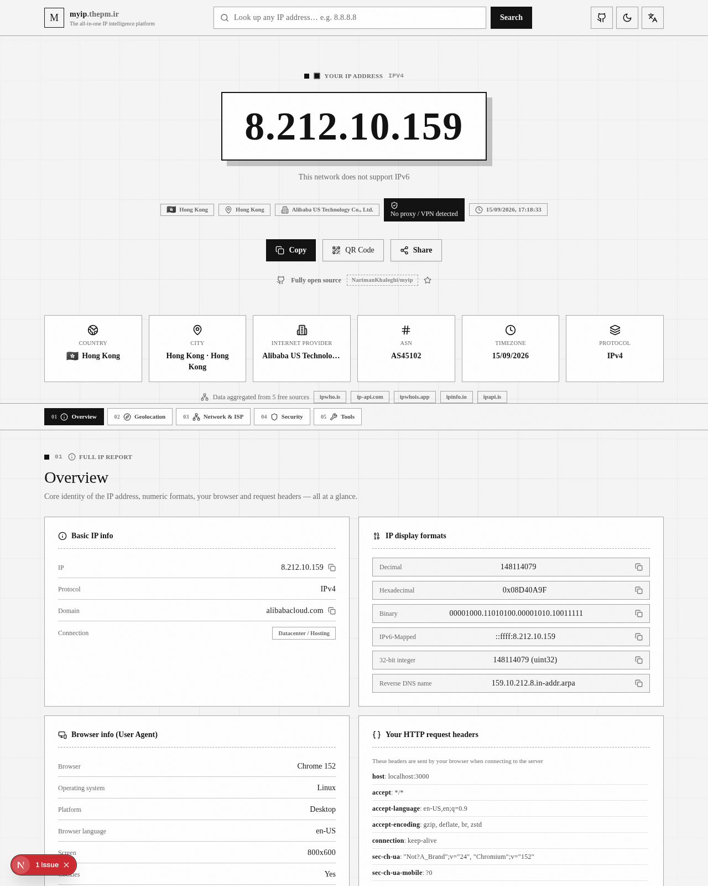
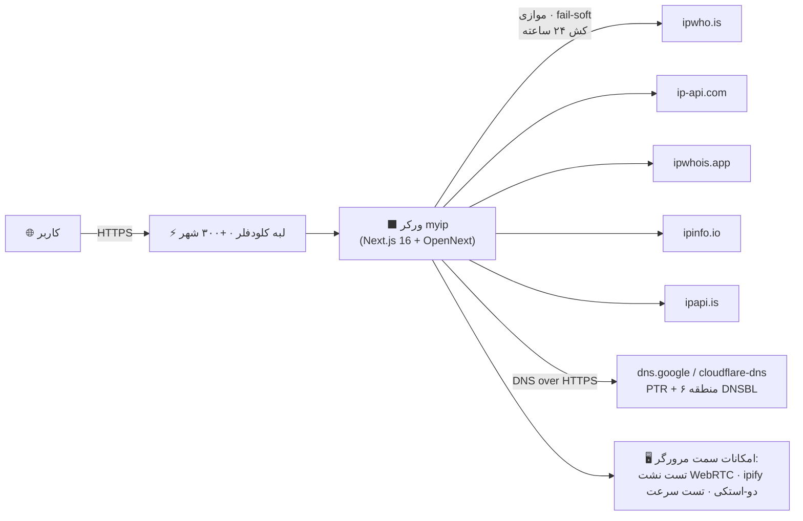

<div dir="rtl" align="center">


# ⚫ myip — هوشمندی اطلاعات IP، در سیاه و سفید ⚪

**پلتفرم رایگان، متن‌باز و بدون ردیابیِ اطلاعات IP — در حال اجرا روی لبه جهانی کلودفلر.**

*The English version of this documentation is available [here](README.md).*

[](https://github.com/NarimanKhaleghi/myip/blob/main/README_FA.md)
[](https://github.com/NarimanKhaleghi/myip)

---

[](https://github.com/NarimanKhaleghi/myip/stargazers)
[](https://github.com/NarimanKhaleghi/myip/forks)
[](https://github.com/NarimanKhaleghi/myip/watchers)
[](https://github.com/NarimanKhaleghi/myip/commits/main)
[](https://github.com/NarimanKhaleghi/myip/blob/main/LICENSE)
[](https://developers.cloudflare.com/workers/)
[](https://pages.github.com/)
[](https://nextjs.org/)
[](https://www.typescriptlang.org/)
[](https://tailwindcss.com/)
[](https://opennext.js.org/cloudflare)

[](https://myip.thepm.ir)
[](https://narimankhaleghi.github.io/myip/)

</div>

<div dir="rtl">

## 📸 تصاویر محیط

| حالت تاریک (پیش‌فرض) | حالت روشن |
|:---:|:---:|
|  |  |

> رابط کاربری **اکیداً تک‌رنگ (سیاه و سفید)** است — کل سایت فقط از دو رنگ (مشکی `#0a0a0a` و سفید `#f5f5f5`) به‌همراه الگوهای وضعیت استفاده می‌کند. هیچ رنگ دیگری. هیچ‌وقت.

## 🌟 درباره پروژه

**myip** به یک سؤال، هزار جواب می‌دهد: *اینترنت درباره آی‌پی من چه می‌داند؟*

بدون هیچ کاری، آی‌پی عمومی IPv4 و IPv6 خودتان را فوراً ببینید — یا هر آدرس IP دلخواه را جست‌وجو کنید تا یک گزارش کامل اطلاعات بگیرید: موقعیت جغرافیایی روی نقشه زنده، جزئیات ASN و ISP، تشخیص پروکسی/VPN/هاستینگ، وضعیت Blacklist (DNSBL)، Reverse DNS، فرمت‌های مختلف IP (دهدهی/مبنای ۱۶/باینری)، تست نشت WebRTC و یک API عمومی JSON. همه‌چیز روی **Cloudflare Workers** و در فاصله چند میلی‌ثانیه‌ای از بازدیدکنندگان شما، در بیش از ۳۰۰ شهر دنیا اجرا می‌شود.

این پروژه **کاملاً متن‌باز (MIT)** و **دوزبانه (فارسی + انگلیسی)** با پشتیبانی کامل RTL/LTR است، **هیچ لاگی نگه نمی‌دارد**، **هیچ تنظیمی لازم ندارد** و در حدود یک دقیقه می‌توانید آن را روی حساب کلودفلر خودتان دیپلوی کنید — چه با اتصال همین ریپو (CI/CD خودکار روی هر push)، چه با یک دستور. این پروژه جایگزین رایگان و قابل‌هاست شخصی برای ipnumberia.com، ipmyp.ir و whatismyipaddress.com است.

## 🎯 قابلیت‌های کلیدی

| ویژگی | توضیحات |
|:------|:---------|
| ⚡ **بومی لبه (Edge)** | اجرا روی Cloudflare Workers (OpenNext + Next.js 16) — از نزدیک‌ترین دیتاسنتر به هر بازدیدکننده |
| 🔢 **IPv4 + IPv6 کامل** | تشخیص واقعی دو-استک: IPv4 عمومی واقعی شما با مسابقه ۶ سرویس فقط-IPv4 (1.1.1.1، icanhazip، ip.sb، ident.me، wtfismyip، ipify) — حتی وقتی مرورگر با IPv6 وصل شده — + آدرس IPv6 شما، و استعلام هر آدرس IPv4/IPv6 |
| 🧠 **تجمیع چند منبعی** | **۵ سرویس API رایگان** را موازی ادغام می‌کند (با fail-soft)؛ قطع شدن یک API هیچ‌وقت استعلام را نمی‌شکند |
| 📄 **گزارش تک‌صفحه‌ای** | هر پنج بخش — اطلاعات پایه، جغرافیا، شبکه و ISP، امنیت، ابزارها — به‌ترتیب اهمیت در یک صفحه چیده شده‌اند با نوار چسبان پرش بین بخش‌ها (scroll-spy). بدون جابه‌جایی بین تب؛ همه‌چیز قابل دیدن و چاپ است |
| 🗺 **نقشه زنده و اطلاعات جغرافیایی** | Leaflet + OpenStreetMap (کاشی‌های خاکستری)، مختصات، منطقه زمانی با ساعت زنده، واحد پول، پیش‌شماره، پایتخت، همسایه‌ها |
| 🏢 **اطلاعات شبکه** | ASN / شماره ASN / سازمان، ISP، Reverse DNS (PTR)، تشخیص هاستینگ یا خانگی، لینک‌های RIR + WHOIS + BGP |
| 🛡 **گزارش امنیتی** | تشخیص پروکسی / VPN / هاستینگ / موبایل، امتیاز ریسک هیوریستیک (۰ تا ۱۰۰)، **۶ بلک‌لیست DNSBL** (SpamCop، SORBS، Spamhaus ZEN، Barracuda، DroneBL و…) از طریق DNS-over-HTTPS |
| 🧪 **تست نشت WebRTC** | بررسی می‌کند که آیا مرورگر شما آی‌پی‌های محلی را از طریق WebRTC ICE لو می‌دهد |
| ⚖️ **مقایسه دو IP** | مقایسه کنار‌به‌کنار دو آدرس با فاصله جغرافیایی (هاورساین) |
| 🕘 **تاریخچه استعلام** | جست‌وجوهای اخیر **فقط در مرورگر خودتان** (localStorage) ذخیره می‌شوند |
| 📤 **خروجی گرفتن** | دانلود هر گزارش به‌صورت JSON / CSV |
| 📶 **تست سرعت** | اندازه‌گیری تأخیر و سرعت دانلود از طریق کلودفلر |
| 🔳 **کد QR** | QR قابل‌اشتراک برای هر گزارش |
| 🌐 **رابط دوزبانه** | رابط کاربری کامل فارسی (RTL) + انگلیسی (LTR)، همراه نام فارسی کشورها |
| 🌗 **تاریک / روشن** | دو تم اکیداً تک‌رنگ |
| 📚 **۱۰ مقاله سئو** | مقالات آموزشی دوزبانه (IP چیست، IPv4 در برابر IPv6، پروکسی در برابر VPN و…) + سوالات متداول |
| 🔌 **REST API عمومی** | ۵ اندپوینت JSON، بدون کلید، بدون احراز هویت، با کش ۲۴ ساعته سمت سرور — پایین‌تر مستند شده |
| 📱 **آماده PWA** | Manifest و آیکون‌ها — به‌عنوان اپ قابل نصب |
| 🎨 **طراحی خالص سیاه و سفید** | نئو-بروتالیسم تک‌رنگ + تایپوگرافی سوئیسی + شبکه Blueprint، سایه‌های سخت، معکوس‌شدن هنگام hover |

## 🔍 چه اطلاعاتی نمایش داده می‌شود؟

| دسته | فیلدها |
|:-----|:--------|
| **هویت** | آدرس IP، نسخه IPv4/IPv6، فرمت‌های دهدهی / مبنای ۱۶ / باینری، IPv6 نگاشت‌شده از IPv4، برچسب‌های Bogon (خصوصی / لوکال‌هاست / link-local / رزرو‌شده) |
| **جغرافیا** | کشور (+ پرچم)، استان، شهر، کد پستی، عرض/طول جغرافیایی، قاره، منطقه زمانی + ساعت محلی زنده، اختلاف UTC، عضویت در اتحادیه اروپا، همسایه‌ها، پایتخت، واحد پول، پیش‌شماره |
| **شبکه** | ASN (مثل `AS15169`)، سازمان ASN، ISP، سازمان، دامنه، hostname مربوط به Reverse DNS (PTR)، منطقه RIR، لینک‌های WHOIS / BGP |
| **امنیت** | فلگ پروکسی، هیوریستیک VPN، تشخیص Tor/هاستینگ، تشخیص اپراتور موبایل، سیگنال‌های سوءاستفاده، امتیاز ریسک ۰ تا ۱۰۰، ۶ منطقه DNSBL با وضعیت مجزا |
| **مرورگر شما** | User-Agent، تمام هدرهای HTTP دریافتی، تست نشت WebRTC، اطلاعات صفحه/زبان/منطقه زمانی |

## 🌐 REST API عمومی

آدرس پایه: `https://myip.thepm.ir/api/v1` — **بدون کلید API، با CORS فعال، خروجی JSON**.
استعلام‌ها برای محافظت از سهمیه‌های رایگان منابع بالادستی، **۲۴ ساعت** سمت سرور کش می‌شوند.

| اندپوینت | توضیحات |
|:---------|:---------|
| `GET /api/v1/ip` | گزارش تجمیعی برای **آی‌پی خودِ فراخوان** |
| `GET /api/v1/ip?raw=1` | فقط آی‌پی فراخوان به‌صورت متن ساده — عالی برای `curl` |
| `GET /api/v1/ip?ip=8.8.8.8` | گزارش تجمیعی برای یک IP مشخص |
| `GET /api/v1/ip/{address}` | همان گزارش، با مسیر تمیز (سازگار با IPv6) |
| `GET /api/v1/dnsbl/{address}` | رکورد PTR + بررسی ۶ بلک‌لیست DNSBL |
| `GET /api/v1/headers` | هدرهای HTTP که مرورگر شما واقعاً ارسال کرده |
| `GET /api/v1/health` | وضعیت سرویس |

```bash
# آی‌پی شما، به‌صورت متن ساده:
curl https://myip.thepm.ir/api/v1/ip?raw=1

# گزارش کامل برای 8.8.8.8:
curl https://myip.thepm.ir/api/v1/ip/8.8.8.8

# بررسی بلک‌لیست + Reverse DNS:
curl https://myip.thepm.ir/api/v1/dnsbl/8.8.8.8
```

<details>
<summary><b>📄 نمونه پاسخ</b> (برای باز شدن کلیک کنید — خلاصه‌شده)</summary>

```json
{
  "ip": "8.8.8.8",
  "version": "IPv4",
  "country": "United States",
  "countryCode": "US",
  "region": "California",
  "city": "San Jose",
  "latitude": 37.3393939,
  "longitude": -121.8949553,
  "timezone": "America/Los_Angeles",
  "utcOffset": "-07:00",
  "asn": "AS15169",
  "asnNumber": 15169,
  "asnOrg": "Google LLC",
  "isp": "Google LLC",
  "hostname": "dns.google",
  "domain": "google.com",
  "isProxy": false,
  "isHosting": true,
  "isMobile": false,
  "riskScore": 30,
  "bogonLabels": [],
  "sourcesUsed": ["ipwho.is", "ip-api.com", "ipwhois.app", "ipinfo.io", "ipapi.is"],
  "sourcesFailed": [],
  "cached": false,
  "fetchedAt": "2026-09-09T17:00:51.260Z"
}
```

پاسخ کامل در [`docs/sample-response.json`](docs/sample-response.json).

</details>

## 🚀 دیپلوی نسخه خودتان — ۴ روش

کل اپلیکیشن **بدون تنظیمات (zero-config)** است: بدون دیتابیس، بدون متغیر محیطی، بدون کلید API. فورک کنید، اتصال بدهید، تمام.
این پروژه از یک کدبیس واحد برای **دو هدف بیلد** آماده شده است:

| هدف | اجرا | حالت | چه چیزی می‌گیرید |
| --- | --- | --- | --- |
| **کلودفلر ورکرز** ⭐ | لبه (۳۰۰+ لوکیشن) | SSR + REST API | همه‌چیز: گزارش کامل، `/api/v1/*`، کش ۲۴ ساعته سرور |
| **گیت‌هاب پیج** | CDN گیت‌هاب | استاتیک، سمت مرورگر | کل رابط کاربری در مرورگر: استعلام با APIهای CORS، دی‌ان‌اس‌بی‌ال با DNS-over-HTTPS |

### ۱) اتصال ریپوی گیت‌هاب (پیشنهادی — CI/CD کامل)

مسیر دیپلوی اصلی همین است: **push روی شاخه `main` → کلودفلر به‌صورت خودکار بیلد و دیپلوی می‌کند.**

<details>
<summary><b>🐙 مرحله صفر: پوش پروژه روی گیت‌هاب از سیستم خودتان</b></summary>

فایل‌های پروژه را روی سیستم خودتان داشته باشید (دانلود ZIP ریپو یا فولدر پروژه). سپس در ترمینال (Git باید نصب باشد — از [git-scm.com](https://git-scm.com)):

```bash
# ۱) وارد پوشه پروژه شوید (مسیر خودتان را بگذارید)
cd myip

# ۲) یک ریپوی خالی در گیت‌هاب بسازید:
#    github.com → Sign in → دکمه + (بالا-راست) → New repository
#    نام: myip   |   Public   |   ⚠️ هیچ گزینه Add README / .gitignore / License را تیک نزنید
#    → Create repository

# ۳) پروژه را init و commit کنید
git init
git branch -M main
git add .
git commit -m "feat: myip v1.1.0 — bilingual IP intelligence on Cloudflare Workers + GitHub Pages"

# ۴) به ریپوی خودتان وصل و پوش کنید (NarimanKhaleghi را با یوزرنیم خودتان عوض کنید)
git remote add origin https://github.com/NarimanKhaleghi/myip.git
git push -u origin main
```

اولین بار گیت‌هاب از شما **احراز هویت** می‌خواهد: در ویندوز Git Credential Manager خودکار مرورگر را باز می‌کند و با «Sign in with browser» لاگین می‌کنید. در لینوکس/مک یک **Personal Access Token** (گیت‌هاب → Settings → Developer settings → Tokens → Generate) بسازید و به‌جای رمز عبور همان را وارد کنید.

راه جایگزین با [GitHub CLI](https://cli.github.com):
```bash
gh auth login
gh repo create myip --public --source=. --remote=origin --push
```
</details>

سپس:

1. به **[dash.cloudflare.com](https://dash.cloudflare.com)** بروید → **Workers & Pages** → **Create** → **Worker** → **Connect Git** (import a repository).
2. اپ **Cloudflare GitHub** را authorize کنید و ریپوی `myip` خودتان را انتخاب کنید (فقط همین ریپو).
3. کلودفلر Next.js را تشخیص می‌دهد و تنظیمات بیلد را پر می‌کند. مطمئن شوید این مقادیر باشند:
   - **Build command:** `npx opennextjs-cloudflare build`
   - **Deploy command:** `npx opennextjs-cloudflare deploy`
   - **Root directory:** `/`
4. **Save and Deploy** را بزنید — اولین بیلد حدود ۲ تا ۳ دقیقه طول می‌کشد.
5. بلافاصله آدرس `https://myip.<زیردامنه-شما>.workers.dev` را می‌گیرید.
6. *(اختیاری)* دامنه اختصاصی: Worker → **Settings** → **Domains & Routes** → **Add Custom Domain** → مثلاً `myip.yourdomain.com`. رکورد DNS و SSL به‌صورت خودکار تنظیم می‌شوند (فقط باید zone دامنه در همان حساب کلودفلر باشد).
7. از این به بعد **هر push روی `main` = یک دیپلوی خودکار جدید** — بدون هیچ کاری.

### ۲) دکمه دیپلوی یک‌کلیکی

[](https://deploy.workers.cloudflare.com/?url=https://github.com/NarimanKhaleghi/myip)

کلیک روی این دکمه، ریپو را داخل **حساب کلودفلر خودتان** کلون می‌کند و همان پایپ‌لاین CI/CD را راه می‌اندازد.

### ۳) خط فرمان Wrangler (از سیستم خودتان)

```bash
git clone https://github.com/NarimanKhaleghi/myip.git
cd myip
bun install            # یا: npm install
npx wrangler login     # مرورگر برای تأیید باز می‌شود
bun run deploy:worker  # بیلد + دیپلوی در یک مرحله
```

### ۴) گیت‌هاب پیج (استاتیک، سمت مرورگر)

یک ورک‌فلو آماده در هر push روی `main` نسخه استاتیک را بیلد و منتشر می‌کند:

1. پروژه را روی گیت‌هاب پوش کنید (مرحله ۱ بالا).
2. در ریپو: **Settings → Pages → Build and deployment → Source: GitHub Actions**.
3. تمام — هر push روی `main` (یا اجرای دستی از تب **Actions**) به‌صورت خودکار روی
   `https://<username>.github.io/myip/` منتشر می‌شود.

نسخه استاتیک کل رابط کاربری را دارد و کاملاً در مرورگر بازدیدکننده اجرا می‌شود: داده‌های IP مستقیماً از APIهای عمومی دارای CORS جمع‌آوری می‌شوند و بررسی‌های PTR و DNSBL از طریق DNS-over-HTTPS انجام می‌شوند (`dns.google` / `cloudflare-dns`). امکانات سمت‌سرور (REST API و هدرهای HTTP) به‌صورت هوشمند محدود می‌شوند و رابط کاربری آنها را به دیپلوی اصلی ورکرز لینک می‌دهد.
برای بیلد دستی نسخه استاتیک:

```bash
bun run build:static    # خروجی در ./out (با BUILD_TARGET=static و مسیر پایه /myip)
```

> **ارتقاءهای اختیاری** (هر دو داخل `wrangler.jsonc` کامنت شده‌اند):
> - **دامنه اختصاصی** (بخش `routes`) — اتصال `myip.yourdomain.com`،
> - **فضای KV** (بخش `kv_namespaces`) — کش بین‌ایزوله برای نرخ hit بالاتر.
> اپ بدون هیچ‌کدام از این‌ها هم کاملاً کار می‌کند.

## 🧰 اجرای محلی (توسعه)

```bash
git clone https://github.com/NarimanKhaleghi/myip.git
cd myip
bun install            # یا: npm install

bun run dev             # سرور توسعه Next.js      → http://localhost:3000
bun run lint            # ESLint (src)
bun run typecheck       # tsc --noEmit
bun run build:worker    # بیلد کامل Workers با OpenNext (بدون نیاز به حساب کلودفلر)
bun run preview:worker  # اجرای ورکر واقعی به‌صورت محلی روی workerd → http://localhost:8787
bun run build:static    # خروجی استاتیک گیت‌هاب پیج → ./out
```

دستور `preview:worker` دقیقاً **همان runtime نسخه پروداکشن** (workerd کلودفلر) را اجرا می‌کند — اگر اینجا کار کرد، دیپلوی‌شده هم کار می‌کند.

## 🏗 معماری و منابع داده



| لایه | تکنولوژی |
|:-----|:----------|
| **Runtime** | Cloudflare Workers + آداپتور OpenNext (`nodejs_compat`) |
| **فریمورک** | Next.js 16 (App Router) · React 19 · TypeScript |
| **رابط کاربری** | Tailwind CSS 4 · shadcn/ui (Radix) · Leaflet + OpenStreetMap · qrcode · lucide-react |
| **داده** | ۵ API رایگان اطلاعات IP (ادغام فیلد‌به‌فیلد) · DoH (dns.google و cloudflare-dns) · ipify (دو-استکی) · speed.cloudflare.com |
| **کش** | کش حافظه‌ای ۲۴ ساعته (به‌ازای هر isolate) — KV اختیاری |
| **فونت‌ها** | Vazirmatn (فارسی) · Inter (انگلیسی) · JetBrains Mono (آی‌پی‌ها) · Lalezar (تیترها) |

هر فراخوانی به منابع بالادستی timeout دارد و **fail-soft** است: اگر یک سرویس از دسترس خارج شود، گزارش همچنان از منابع باقی‌مانده ساخته می‌شود و فیلد `sourcesFailed` به شما می‌گوید چه اتفاقی افتاده. هیچ نقطه شکست واحدی وجود ندارد.

## 🎨 سیستم طراحی — سیاه و سفید خالص

myip عمداً و **اکیداً تک‌رنگ** است: فقط `#0a0a0a` و `#f5f5f5` (و ترکیب‌های آلفای همین دو) در همه‌جا به چشم می‌آید — دکمه‌ها، نمودارها، نقشه و حتی پرچم کشورها خاکستری رندر می‌شوند.

| توکن | مقدار | کاربرد |
|:-----|:------|:--------|
| گوشه‌های تیز | `border-radius: 0` | همه‌چیز به‌جز چیپ‌های گرد |
| سایه‌های سخت | آفست `4px 4px 0` | حالت‌های hover/press — بدون blur |
| وضعیت = الگو | توپر / هاشور / خط‌چین | خوب / هشدار / نامشخص — هرگز رنگ |
| شبکه Blueprint | گرید ۷۲px پس‌زمینه + ۴٪ نویز | حس «کاغذ مهندسی» |
| معکوس‌شدن هنگام hover | جابه‌جایی fg↔bg + `translate(-2px,-2px)` | دکمه‌ها، لینک بخش‌ها، چیپ‌ها |
| نشانگر سفارشی | نقطه + حلقه، `mix-blend-mode: difference` | فقط دسکتاپ، با احترام به reduced-motion |

مجموعه کامل توکن‌ها در [`src/app/globals.css`](src/app/globals.css) قرار دارد.

## 🔒 حریم خصوصی

- **بدون حساب کاربری، بدون کوکی، بدون آنالیتیکس، بدون لاگ.** ورکر هیچ چیزی روی دیسک ذخیره نمی‌کند.
- تاریخچه استعلام **فقط در localStorage مرورگر خودتان** می‌ماند — پاکش کنید تا برای همیشه از بین برود.
- تنها داده‌ای که myip لمس می‌کند همان آی‌پیِ استعلام‌شده است که برای ساختن گزارش به APIهای عمومی اطلاعات IP ارسال می‌شود — ذخیره نمی‌شود، به کسی فروخته نمی‌شود.
- خودتان دیپلویش کنید تا حتی لازم هم نباشد به ما اعتماد کنید. 😉

## 📣 معرفی سایت به گوگل (راهنمای سئو)

هر چیزی که گوگل نیاز دارد **از قبل داخل پروژه ساخته شده**: `sitemap.xml`، `robots.txt`، canonical، Open Graph + Twitter Cards، داده ساختاریافته JSON-LD (`WebApplication` و `WebSite` + `SearchAction`)، ۱۰ مقاله دوزبانه و بخش سوالات متداول. فقط باید به گوگل بگویید وجود دارید:

1. **[Google Search Console](https://search.google.com/search-console)** را باز کنید و با حساب گوگل وارد شوید.
2. **Add property → Domain → `thepm.ir`** (این نوع، همه زیردامنه‌ها از جمله `myip.` را پوشش می‌دهد).
3. گوگل یک **رکورد TXT** به شما می‌دهد. آن را در **داشبورد کلودفلر → دامنه شما → DNS → Add record** اضافه کنید (نوع `TXT`، نام `@`، مقدار را paste کنید). ۱ تا ۵ دقیقه صبر کنید و در سرچ کنسول **Verify** بزنید.
4. از منوی چپ به **Sitemaps** بروید، آدرس `https://myip.thepm.ir/sitemap.xml` را وارد و **Submit** کنید.
5. **URL Inspection** (نوار جست‌وجوی بالا) را باز کنید، `https://myip.thepm.ir/` را paste کنید و **Request indexing** بزنید.
6. همین کار را برای `https://myip.thepm.ir/?lang=en` و مقاله‌های موردعلاقه‌تان تکرار کنید.
7. اولین نمایش در گوگل معمولاً طی **۱ تا ۷ روز** اتفاق می‌افتد؛ رتبه‌ها طی هفته‌های بعد رشد می‌کنند.

**نکته‌های ایندکس سریع‌تر:** سایت را از پروفایل گیت‌هاب، ریپوهای دیگر و شبکه‌های اجتماعی لینک کنید (بک‌لینک = مسیر کشف توسط خزنده)؛ لینک‌هایی به شکل `https://myip.thepm.ir/ip/8.8.8.8` را در جواب‌ها و انجمن‌ها به اشتراک بگذارید؛ همان sitemap را در **[Bing Webmaster Tools](https://www.bing.com/webmasters)** هم ثبت کنید (با یک کلیک همه‌چیز را از گوگل import می‌کند)؛ و محتوا را روان نگه دارید — هر دیپلوی، `lastmod` نقشه سایت را تازه می‌کند.

## 🗺 نقشه راه

- [ ] اتصال کش KV / Durable Object برای نرخ hit بین‌ایزولتی
- [ ] بررسی متقاطع لیست نودهای خروجی Tor
- [ ] استعلام اطلاعات سوءاستفاده/تماس (ایمیل abuse در WHOIS) برای IPهای گزارش‌شده
- [ ] زبان‌های بیشتر (عربی، ترکی و…)
- [ ] فید RSS/Atom برای مقالات
- [ ] سرور کاشی نقشه اختیاری برای نقشه‌های کاملاً مستقل

## 🤝 مشارکت

مشارکت‌ها بسیار خوش‌آمدند!

```bash
git clone https://github.com/NarimanKhaleghi/myip.git
cd myip && npm install
npm run dev        # توسعه روی http://localhost:3000
```

- از شاخه `main` برنچ بزنید و PRها را متمرکز نگه دارید.
- `npm run lint` و `npm run typecheck` باید پاس شوند (CI هر دو + یک بیلد کامل Workers را اجباری می‌کند).
- **قانون طراحی:** رابط کاربری اکیداً سیاه و سفید می‌ماند — وضعیت باید با الگو (توپر/هاشور/خط‌چین) بیان شود، نه رنگ.
- منبع داده جدید؟ یک آداپتور در `src/lib/ip-sources.ts` اضافه و در `ALL_SOURCES` ثبتش کنید.

راهنمای کامل در [`CONTRIBUTING.md`](CONTRIBUTING.md).

## ❓ سوالات متداول

<details>
<summary><b>myip واقعاً رایگان است؟</b></summary>

بله — کد با لایسنس MIT منتشر شده و همه منابع بالادستی سطح رایگان دارند. پلن رایگان Cloudflare Workers (۱۰۰ هزار درخواست در روز) برای دیپلوی شخصی یا جامعه‌های کوچک کافی است.
</details>

<details>
<summary><b>چرا شهر من اشتباه نشان داده می‌شود؟</b></summary>

اطلاعات جغرافیایی IP یک *برآورد دیتابیسی* از محل نقطه مسیریابی ISP شماست — نه GPS. دقت معمولاً در سطح شهر/استان است و روی شبکه‌های موبایل یا VPN بدتر می‌شود. myip داده ۵ منبع را کنار هم نشان می‌دهد تا مقایسه کنید.
</details>

<details>
<summary><b>آیا آی‌پی من ذخیره می‌شود؟</b></summary>

خیر. نه دیتابیسی وجود دارد و نه لاگ درخواست. تنها ذخیره‌سازی، localStorage مرورگر خودتان است (تم، زبان، تاریخچه استعلام).
</details>

<details>
<summary><b>چطور آی‌پی‌ام را مخفی کنم؟</b></summary>

به‌ترتیب راحتی: VPN معتبر، مرورگر Tor، یا پروکسی. بعد بخش امنیت را در myip دوباره چک کنید تا ببینید هنوز چه چیزی لو می‌رود (WebRTC معمول‌ترین مورد است).
</details>

<details>
<summary><b>می‌توانم از API استفاده تجاری کنم؟</b></summary>

خود API مربوط به myip: بله، استفاده منصفانه. اما شرایط منابع بالادستی را رعایت کنید — اگر حجم سنگین می‌خواهید، نمونه خودتان را دیپلوی کنید و کلیدهای API پولی خودتان را اضافه کنید.
</details>

## 📞 تماس

| کانال | لینک |
|:------|:-----|
| 🌐 وب‌سایت | [myip.thepm.ir](https://myip.thepm.ir) |
| 🐙 گیت‌هاب | [github.com/NarimanKhaleghi/myip](https://github.com/NarimanKhaleghi/myip) |
| ✉️ ایمیل | [pm@thepm.ir](mailto:pm@thepm.ir) |
| 🐛 گزارش باگ و پیشنهاد | [Issues](https://github.com/NarimanKhaleghi/myip/issues) |

## 📄 لایسنس

منتشرشده تحت **لایسنس MIT** — متن کامل در [`LICENSE`](LICENSE).
رایگان برای استفاده، تغییر و هاست شخصی. یک ⭐ استار، همیشه خوشایند است!

---

<div align="center">


**ساخته شده با ❤️ توسط نریمان**

**Made with ❤️ by Nariman**

MIT © 2026 Nariman Khaleghi · [github.com/NarimanKhaleghi/myip](https://github.com/NarimanKhaleghi/myip)

</div>


</div>
